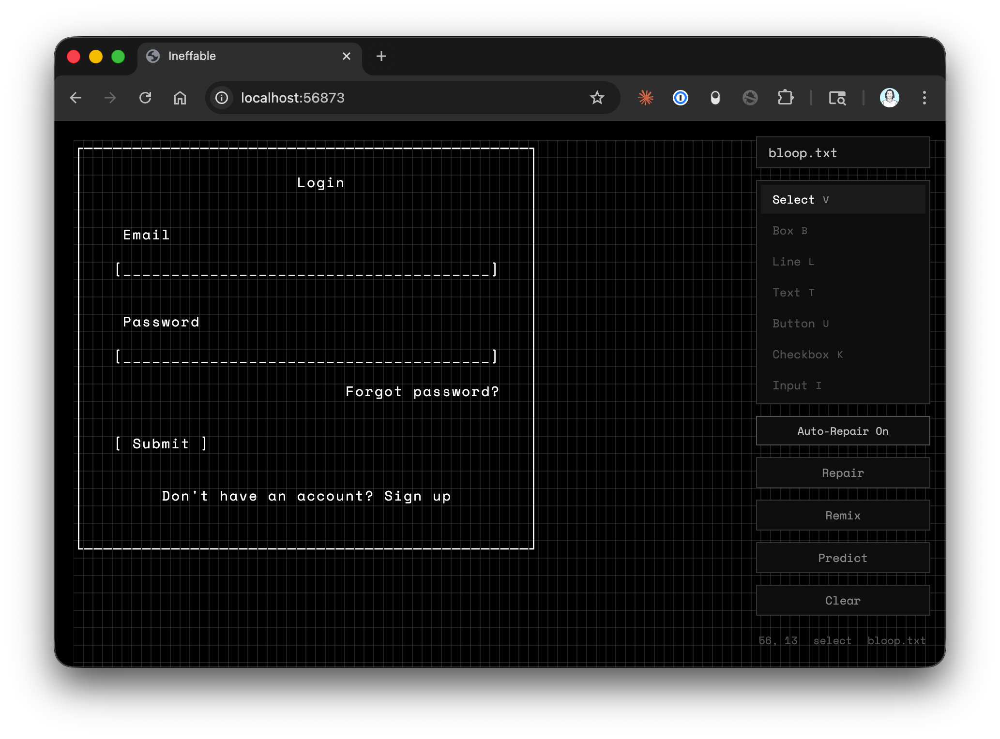

# Ineffable



An ASCII diagram editor for designing UI with Claude. Because sometimes words aren't good enough.

I've always preferred designing directly in the browser. I want to work the same way with Claude Code - no mock-ups or wireframes necessary - but Claude makes UI design choices I disagree with constantly, and using _English_ to explain how to arrange things is exhausting. I discovered that sketching ASCII diagrams was a fast and effective way to communicate layout and structure. But the Claude Code prompt field is a terrible ASCII editor, so I built Ineffable. Everything about Ineffible was designed for collaboration with AI: for example, it has no intermediate format, so AI agents can easily understand the format and directly edit your Ineffible diagrams. 

## Current status

Ineffable is early in development but already useful (I use it every day). I features as I need them.

Today, the best way to use Ineffable is to install it in per-project via NPM and run it from the command line, then open up the port it's running in the browser. VS Code plugin coming soon.

## Install

```bash
npm install -D ineffable
```

## Quick start

Run `ineffable` in any project directory to open the editor:

```bash
npx ineffable
```

By default, diagrams are stored in an `ineffable-diagrams/` directory (created automatically if it doesn't exist). You can point it at a different folder:

```bash
npx ineffable ./diagrams
```

This starts a local server and opens a browser-based canvas editor. Any `.txt` files in the directory (including subdirectories) are listed in the file picker.

### Options

```
ineffable [directory] [--port <port>]

  directory    Target directory to scan for .txt files (default: ./ineffable-diagrams)
  --port       Server port (default: 3001, or PORT env var)
```

## Usage

### Drawing

Select a tool from the toolbar or use keyboard shortcuts:

| Tool     | Key | Interaction                     |
|----------|-----|---------------------------------|
| Select   | V   | Click a widget to select it     |
| Box      | B   | Click + drag to draw            |
| Line     | L   | Click + drag to draw            |
| Text     | T   | Click to place, enter text      |
| Button   | U   | Click to place, enter label     |
| Checkbox | K   | Click to place, enter label     |
| Input    | I   | Click or drag to set width      |

Press **Escape** to return to the select tool.

### Selecting widgets

Click a widget to select it. Click and drag on empty canvas space to box-select multiple widgets.

### Editing widgets

Double-click a text or button widget to edit its content inline. Press **Enter** to save or **Escape** to cancel.

### Moving and resizing

- **Move**: Select widget(s), then click + drag. Children of a selected box move with it.
- **Resize**: Select a single widget and drag one of its resize handles.
- **Nudge**: Select widget(s) and press **Shift + Arrow keys** to move one cell at a time.
- **Delete**: Select widget(s) and press **Delete** or **Backspace**.

### Undo / Redo

**Cmd+Z** to undo, **Cmd+Shift+Z** to redo (Ctrl on Windows/Linux).

### AI edits

Three AI actions are available from the toolbar:

| Action  | What it does                                                  |
|---------|---------------------------------------------------------------|
| Repair  | Fixes broken or overlapping widgets                           |
| Remix   | Rearranges the layout while preserving all content            |
| Predict | Adds new widgets based on what's already there                |

Click an action, optionally type additional instructions, and hit Submit. The canvas reloads live with the result.

AI features require the [Claude Code CLI](https://docs.anthropic.com/en/docs/claude-code) (`claude`) to be installed and authenticated. The server spawns `claude` as a subprocess — this uses your Anthropic API credits.

### Live reload

Any external change to a `.txt` file in your target directory (from an LLM, a text editor, a script) triggers a live reload in the browser via WebSocket. This means you can have Claude Code edit diagram files directly and see the results instantly.

## Widget reference

See [PATTERNS.md](PATTERNS.md) for full pattern definitions.

```
Box:       ┌──────┐        Button:     [ Submit ]
           │      │
           └──────┘        Checkbox:   [x] Remember me
                                       [ ] Newsletter
Text:      Hello world
                           Input:      [____________]
                           Line:       ──────── (horizontal)
                                       │ (vertical)
```

## Development

```bash
git clone <repo-url>
cd ineffable
pnpm install
pnpm dev
```

See [CONTRIBUTING.md](CONTRIBUTING.md) for project structure and architecture details.
